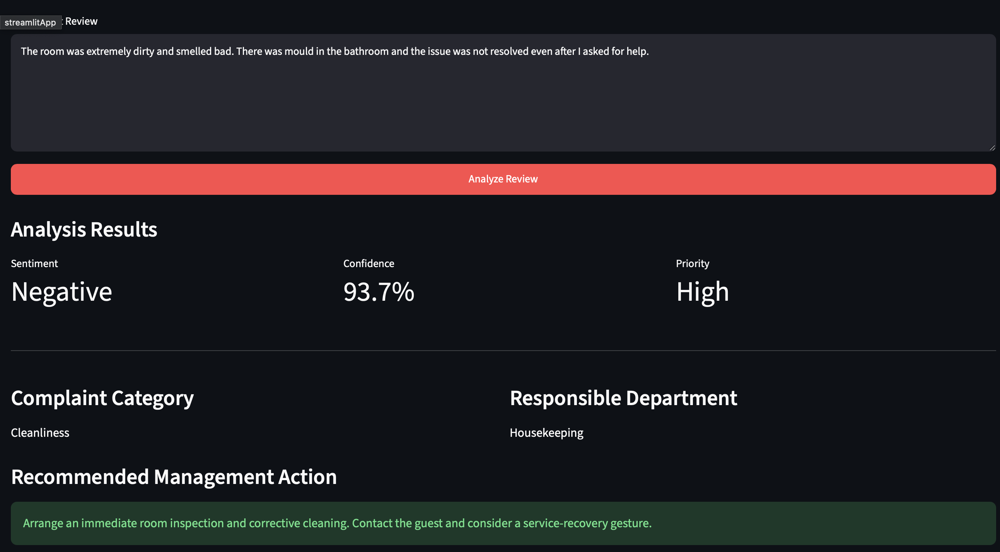
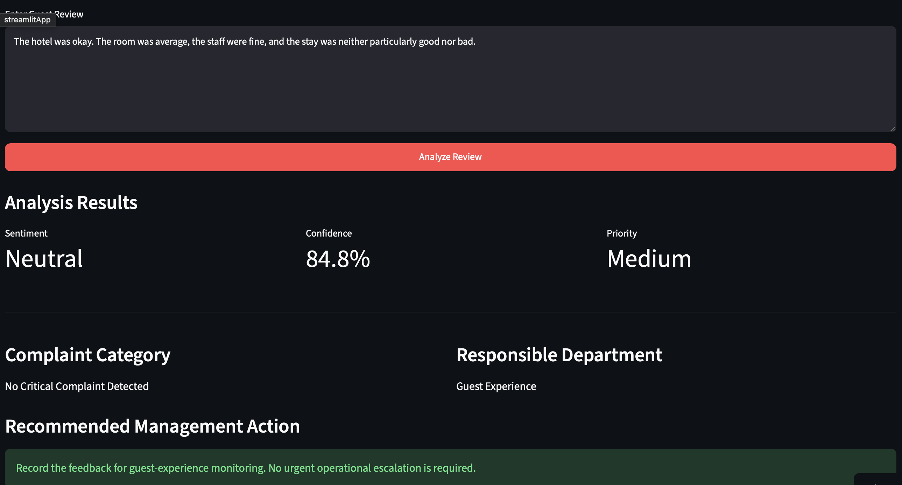
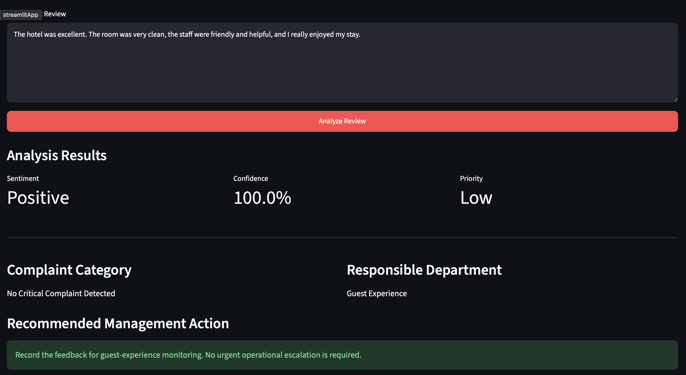

# Hotel Review Sentiment Analysis + Complaint Theme Detection

## 🚀 Live Application

[Launch Hotel Review Intelligence](https://aboubacar-hotel-review-intelligence.streamlit.app)

Interactive Streamlit application that analyzes hotel guest reviews and returns sentiment, confidence score, operational priority, complaint category, responsible department, and recommended management action.
## 📸 Application Demo

The deployed application converts hotel guest feedback into actionable operational intelligence, including sentiment, confidence, priority, complaint category, responsible department, and recommended management action.

### 🔴 Negative Review — High Priority

The system identifies a serious cleanliness complaint, classifies the review as negative, assigns high operational priority, routes the issue to Housekeeping, and recommends an immediate service-recovery action.

### 🟡 Neutral Review — Medium Priority

Neutral guest feedback is classified for monitoring and assigned medium priority when no urgent operational escalation is required.

### 🟢 Positive Review — Low Priority

Positive guest feedback is recognized as low priority and can be retained for guest-experience monitoring and performance insights.

## Business Problem
Hotels receive thousands of guest reviews. Manually reading them is slow and inconsistent.  
This project automatically classifies reviews as Positive, Neutral, or Negative and extracts the most common complaint themes (room, staff, cleanliness, price, etc.).

This helps marketing and guest-experience teams:
- Quickly detect unhappy guests
- Identify recurring operational problems
- Prioritize improvements that impact guest satisfaction

## Dataset
- Source: TripAdvisor Hotel Reviews (Kaggle)
- Size: 20,491 reviews
- Columns: Review text + Rating (1–5)

## Approach
1. Created sentiment labels from ratings (1-2 = Negative, 3 = Neutral, 4-5 = Positive)
2. Cleaned the review text
3. Converted text to numbers using TF-IDF
4. Trained a Logistic Regression classifier
5. Extracted common complaint themes from negative reviews

## Results
- **Accuracy: 85.6%**
- Strong performance on Positive and Negative classes
- Neutral class is harder (expected)

### Top Complaint Themes in Negative Reviews
1. Room
2. Staff / Service
3. Food / Breakfast
4. Cleanliness (dirty, smell, filthy)
5. Bed / Bathroom / Size
6. Price / Value

## Business Impact
Negative reviews most frequently mention **room condition**, **staff service**, and **cleanliness**.  
These insights can directly feed into guest recovery campaigns and operational improvements.

## Tech Stack
- Python, pandas, scikit-learn
- TF-IDF + Logistic Regression
- Basic NLP text cleaning and theme extraction
